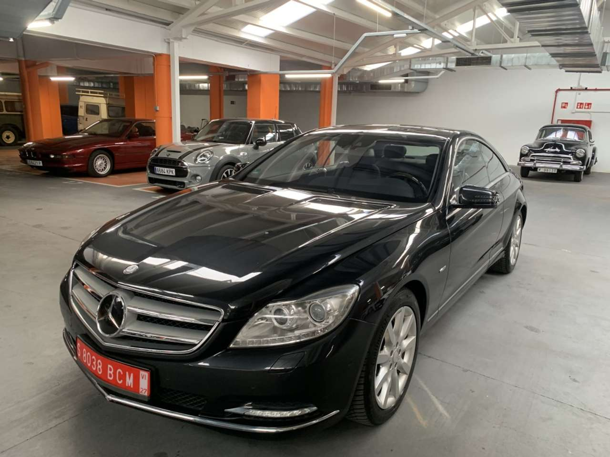
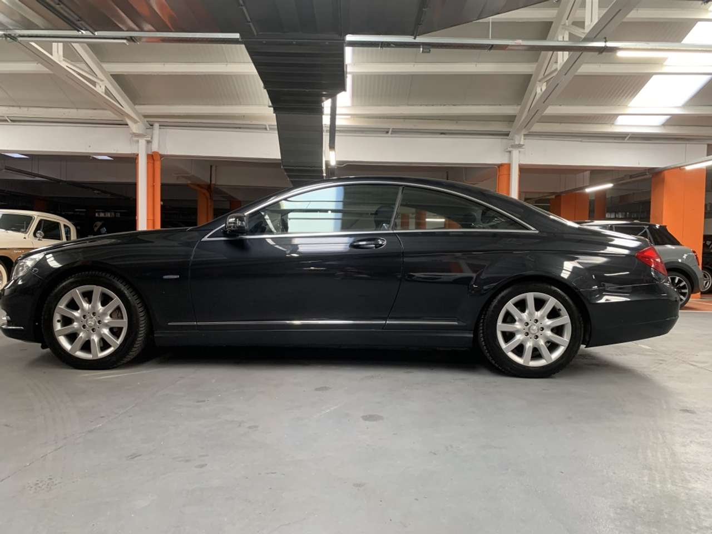
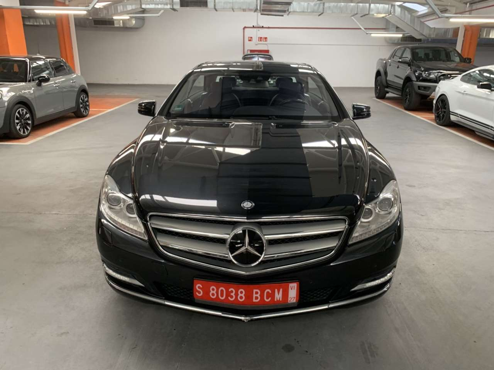
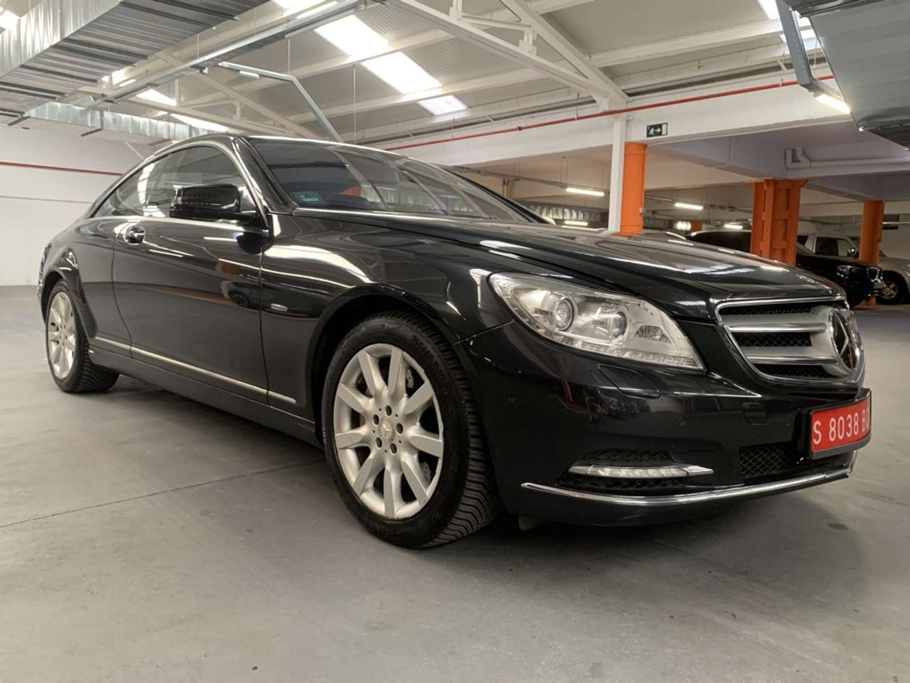
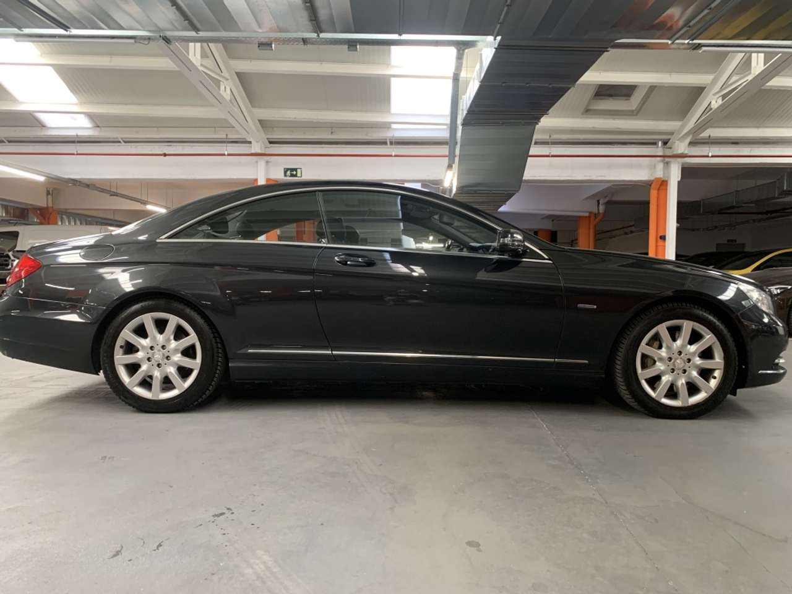
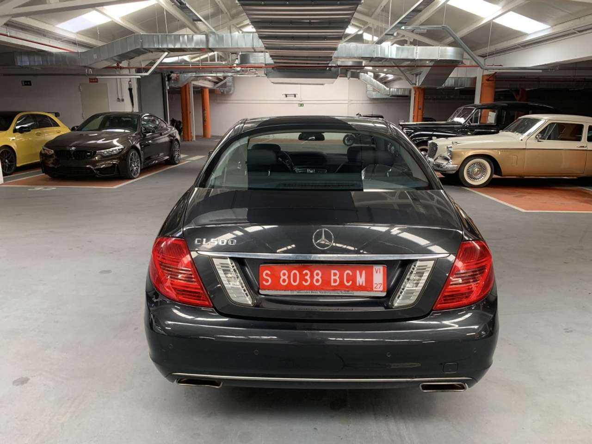
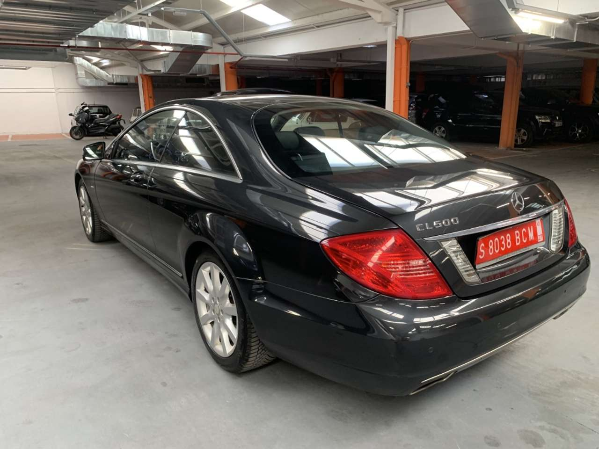
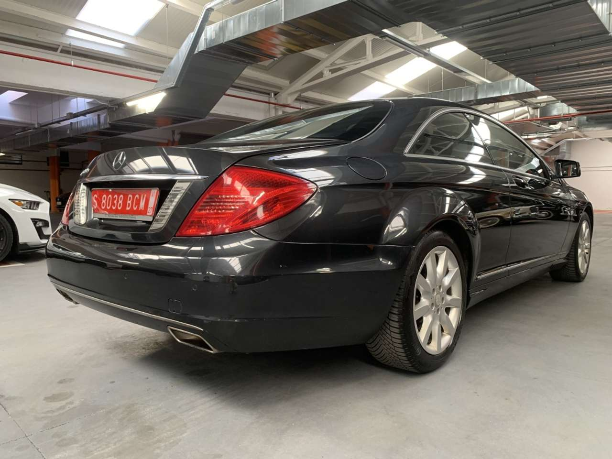

# Mercedes-Benz CL 500 BE Aut.

**Precio: € 24.800**

> Precio medio de mercado según AutoScout24: € 26.100

## Ficha técnica

| Campo | Valor |
| --- | --- |
| Marca | Mercedes-Benz |
| Modelo | CL 500 |
| Versión | BE Aut. |
| Tipo de vehículo | Coupé |
| Estado | Ocasión |
| Kilometraje | 196.000 km |
| Primera matriculación | 09/2011 |
| Potencia | 435 CV |
| Potencia (kW) | 320 kW |
| Cilindrada | 4.663 cm³ |
| Combustible | Gasolina |
| Cambio | Automático |
| Tracción | Tracción trasera |
| Puertas | 2 |
| Plazas | 4 |
| Color exterior | Negro |
| Tipo de pintura | Metalizado |
| Mercado de origen | España |

## Consumo y emisiones

| Campo | Valor |
| --- | --- |
| Consumo combinado | 9,50 l/100 km (mixto) |
| Filtro de partículas | No |

## Dimensiones y pesos

| Campo | Valor |
| --- | --- |
| Peso en vacío | 2.070 kg |

## Estado e historial

| Campo | Valor |
| --- | --- |
| Ha tenido accidentes | No |
| Libro de mantenimiento completo | No |
| ITV nueva | No |
| No fumador | No |
| Vehículo de alquiler | No |
| Garantía | 12 mes |

## Equipamiento

### Comodidad

- Asientos calef.
- Climatizador automático
- Elevalunas eléctrico
- Retrovisores laterales eléctricos
- Sensor de lluvia
- Volante multifunción

### Entretenimiento / Medios

- Bluetooth
- MP3
- Ordenador

### Extra

- Llantas de aleación

### Seguridad

- ABS
- Airbag del conductor
- Airbag trasero
- Airbags laterales
- Alarma
- Cierre centralizado
- ESP
- Faros antiniebla
- Faros de xenon
- Isofix

## Descripción del anuncio

**Precio al contado: 24900 euros**

**Condiciones de la financiación**

Sujeto a la aprobación de la entidad financiera.

**Mercedes-Benz CL 500 BlueEFFICIENCY 4.7 V8 Biturbo 435 CV  – Full Equip**

Exclusivo Mercedes-Benz CL 500 (C216) matriculado en **enero de 2011**, equipado con el prestigioso motor **4.7 V8 Biturbo de 435 CV**, asociado al cambio automático **7G-TRONIC**.

Unidad **importada de Alemania**, ITV alemana (TÜV) favorable y algún mantenimiento acreditado. Vehículo muy cuidado tanto de carrocería como de interior.

Elegante configuración en **Negro Magnetita Metalizado** con interior en **cuero negro perforado**, molduras en madera noble y un nivel de equipamiento muy superior a la media.

**Equipamiento principal**

- Motor V8 Biturbo 4.7 de 435 CV
- Cambio automático 7G-TRONIC con levas en el volante
- Suspensión activa **ABC (Active Body Control)**
- Asientos eléctricos multicontorno con memoria
- Asientos delanteros calefactados y ventilados
- Volante calefactable
- Sistema de sonido **Harman Kardon Logic7**
- Navegador COMAND APS
- Teléfono integrado
- Bluetooth
- Cámara de visión trasera
- Sensores de aparcamiento delanteros y traseros (Parktronic)
- Faros Bi-Xenón Intelligent Light System (ILS)
- Luces diurnas LED
- Control de crucero adaptativo **Distronic Plus**
- Asistente activo de mantenimiento de carril
- Asistente de ángulo muerto
- Reconocimiento de señales de tráfico
- Climatizador automático Thermotronic
- Acceso y arranque sin llave (Keyless-Go)
- Retrovisores eléctricos, calefactados y abatibles
- Cortinilla trasera eléctrica
- Sistema de apertura para objetos largos (Through Loading)
- Llantas de aleación originales Mercedes
- Inserciones interiores en madera noble
- Volante multifunción en cuero y madera
- Control por voz
- Sensor de lluvia y luces automáticas

**Estado**

Vehículo en un estado excepcional de conservación.

- **196.730 km**
- Dos llaves
- Libro de mantenimiento
- Historial completo de revisiones
- ITV alemana favorable
- Mecánica en perfecto funcionamiento
- Motor V8
- Interior muy cuidado, sin desgastes

**Datos principales**

- Primera matriculación: **01/2011**
- Motor: **4.7 V8 Biturbo**
- Potencia: **435 CV**
- Cambio: **Automático 7G-TRONIC**
- Tracción trasera
- Combustible: Gasolina
- Distintivo ambiental: **C**
- Color: Negro Magnetita Metalizado
- Interior: Cuero negro

**Precio**

**24.900€**

**Transferencia y garantía incluida.**

Se acepta prueba mecánica en taller.

**Extras**
**Equipamiento destacado seleccionado por el usuario**

- Persiana trasera enrollable eléctricamente
- Llantas aleación 10 radios y 18´´
- Sistema de control de presión de inflado de los neumáticos (RDK)
- Saco para esquís
- Persiana eléctrica para la luneta trasera
- Cámara para visualización parte trasera
- Compartimiento refrigerado en apoyabrazos trasero
- Calefacción del volante
- Seguro adicional de la tapa del maletero
- Cuero anilina exclusivo designo unicolor
- Volante en cuero y madera designo
- Compartimiento refrigerado en apoyabrazos trasero + Saco para esquís
- Volante en cuero/madera
- Keyless Go
- Reposacabezas traseros desplegables automáticamente con cinturón
- Asientos delanteros confort ventilados y calefactados
- Paquete de asistencia a la conducción
- Techo alcántara designo gris alpaca
- Asistente para visión nocturna PLUS con detector de peatones
- Molduras de madera arce designo natural

## Vendedor

| Campo | Valor |
| --- | --- |
| Vendedor | AUTOCLUB TRACKDAYS |
| Tipo | Dealer |
| Teléfono | +34919379322 |
| WhatsApp | +34 - 919375215 |
| Dirección | C/ ISLA DE SUMATRA Nº36, 28034, MADRID, ES |
| Coordenadas | 40.49536, -3.68608 |
| Ficha del concesionario | https://www.autoscout24.es/profesionales/autoclub-trackdays/acerca-de-nosotros |

## Imágenes

8 imágenes en `media/`.

---

- **Referencia:** 20889522
- **Anuncio original:** https://www.autoscout24.es/anuncios/mercedes-benz-cl-500-be-aut-gasolina-negro-cat_ma47mo18512-b40e3a96-1b55-4baa-b79d-9ff0a4480525?source=dealerpage_stock-list
