# MINI One

**Precio: € 3.300**

> Precio medio de mercado según AutoScout24: € 3.700

## Ficha técnica

| Campo | Valor |
| --- | --- |
| Marca | MINI |
| Modelo | One |
| Variante | 3 Door |
| Tipo de vehículo | Coche pequeño |
| Estado | Ocasión |
| Kilometraje | 297.000 km |
| Primera matriculación | 07/2003 |
| Potencia | 90 CV |
| Potencia (kW) | 66 kW |
| Cilindrada | 1.598 cm³ |
| Combustible | Gasolina |
| Cambio | manual |
| Tracción | Tracción delantera |
| Puertas | 3 |
| Plazas | 4 |
| Color exterior | Negro |
| Tipo de pintura | Metalizado |
| Mercado de origen | España |

## Consumo y emisiones

| Campo | Valor |
| --- | --- |
| Consumo combinado | 6,50 l/100 km (mixto) |
| Filtro de partículas | No |

## Dimensiones y pesos

| Campo | Valor |
| --- | --- |
| Peso en vacío | 1.075 kg |

## Estado e historial

| Campo | Valor |
| --- | --- |
| Ha tenido accidentes | No |
| Libro de mantenimiento completo | No |
| ITV nueva | No |
| No fumador | No |
| Vehículo de alquiler | No |
| Garantía | 12 mes |

## Equipamiento

### Comodidad

- Elevalunas eléctrico
- Ventanas tintadas

### Seguridad

- ABS
- Airbag acompañante
- Airbag del conductor
- Airbags laterales
- Cierre centralizado
- Dirección asistida
- Inmovilizador

## Descripción del anuncio

**Precio al contado: 3400 euros**

**Condiciones de la financiación**

Sujeto a la aprobación por parte de la entidad financiera.

**MINI One 1.6 90 CV – MUY CUIDADO | CarPlay | Libro de mantenimiento | ITV | Manual**

**Precio: 2.990 €**

Se vende MINI One 1.6 gasolina de 90 CV con cambio manual, con mantenimiento al día y libro de revisiones.

A pesar de su kilometraje, el coche funciona correctamente, tiene muy buena presencia y resulta ideal como primer coche, uso diario o para quien busque un MINI clásico de la primera generación.

**Equipamiento**

- Motor 1.6 gasolina 90 CV.
- Cambio manual de 5 velocidades.
- Aire acondicionado.
- Dirección asistida.
- Elevalunas eléctricos.
- Cierre centralizado con mando.
- Espejos eléctricos.
- Radio multimedia 2 DIN con pantalla táctil.
- Apple CarPlay.
- Android Auto.
- Bluetooth manos libres y música.
- USB.
- Llantas de aleación blancas.
- Techo blanco.
- Retrovisores blancos.
- Franjas deportivas en capó y portón.
- Faros antiniebla.
- Asientos deportivos MINI.
- Dos llaves.
- Manuales originales.
- Libro de mantenimiento.

**Mantenimiento**

- Libro de revisiones.
- Última revisión importante realizada sobre los **259.300 km**, hace 2.000 kms se le cambio aceite y filtros.
- Historial de mantenimiento documentado.
- ITV en vigor (si procede).

**Estado**

Interior muy cuidado, tapicería en muy buen estado, volante y pomo con poco desgaste para los kilómetros. Carrocería con muy buena presencia y pintura brillante.

**Kilómetros:** 297.350 km.

Precio transferido y con un año de garantía.

**Extras**
**Equipamiento destacado seleccionado por el usuario**

- Enigmatic Black metalizado
- Aire acondicionado
- Llantas de aleación ligera más de 17´´

## Vendedor

| Campo | Valor |
| --- | --- |
| Vendedor | AUTOCLUB TRACKDAYS |
| Tipo | Dealer |
| Teléfono | +34919379322 |
| WhatsApp | +34 - 919375215 |
| Dirección | C/ ISLA DE SUMATRA Nº36, 28034, MADRID, ES |
| Coordenadas | 40.49536, -3.68608 |
| Ficha del concesionario | https://www.autoscout24.es/profesionales/autoclub-trackdays/acerca-de-nosotros |

## Imágenes

11 imágenes en `media/`.

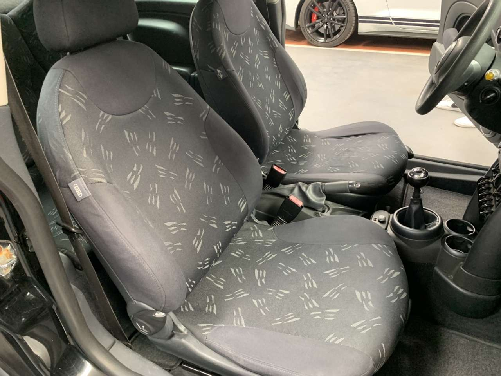
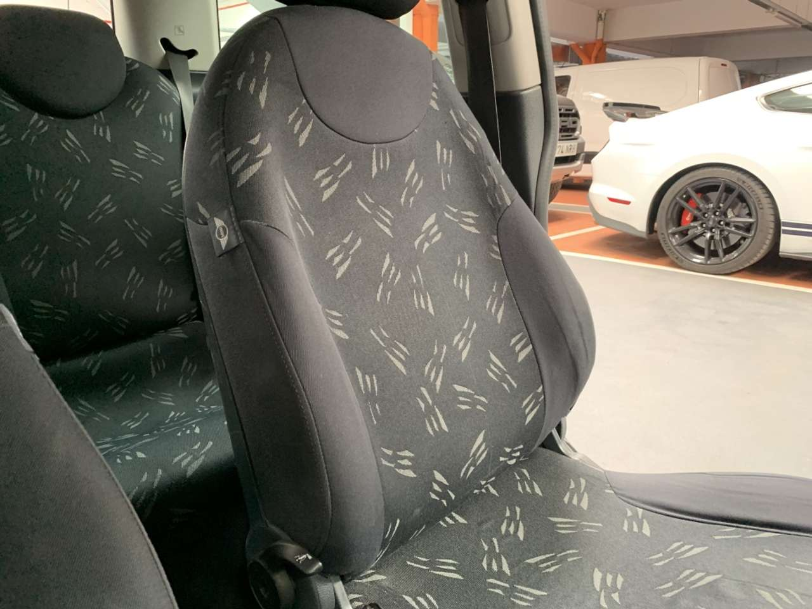
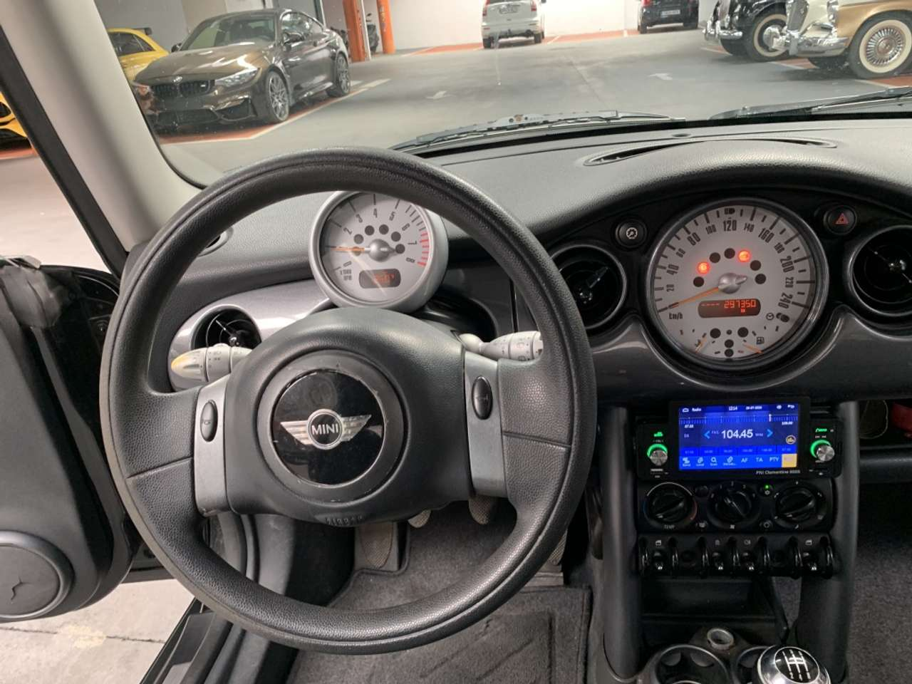
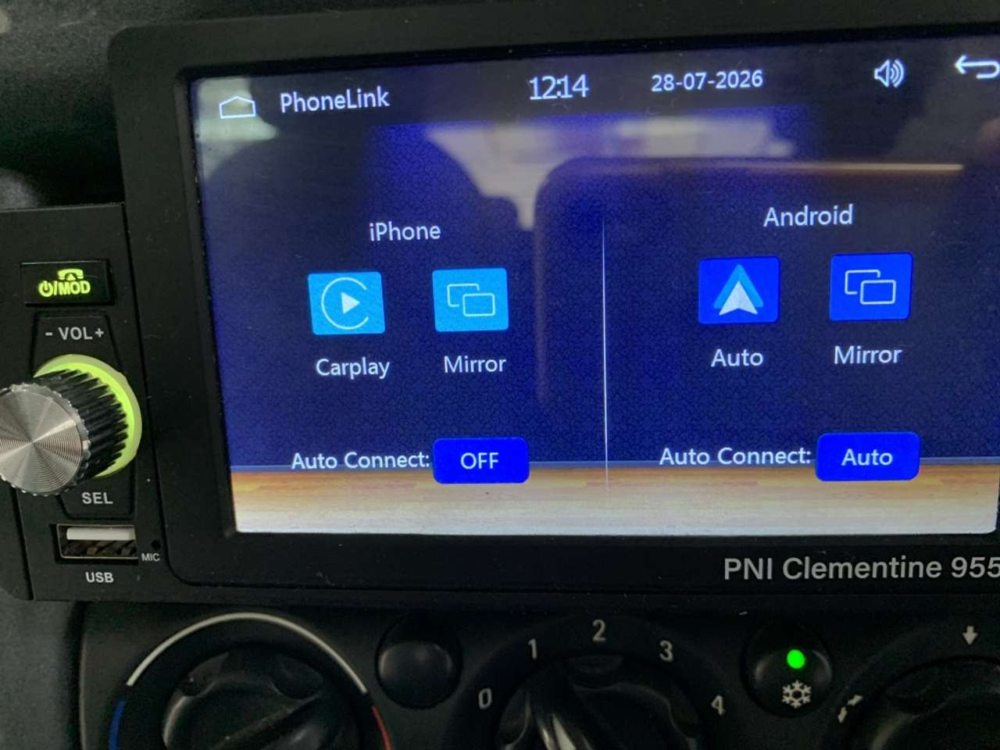
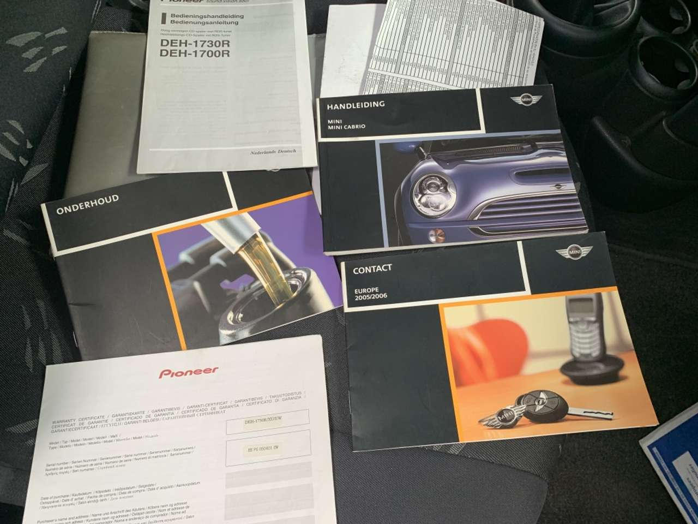
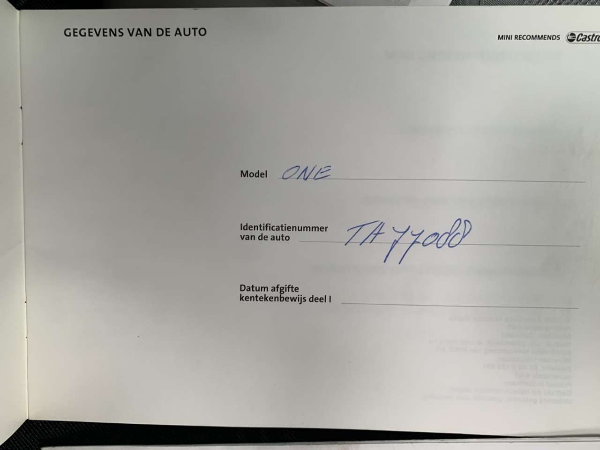
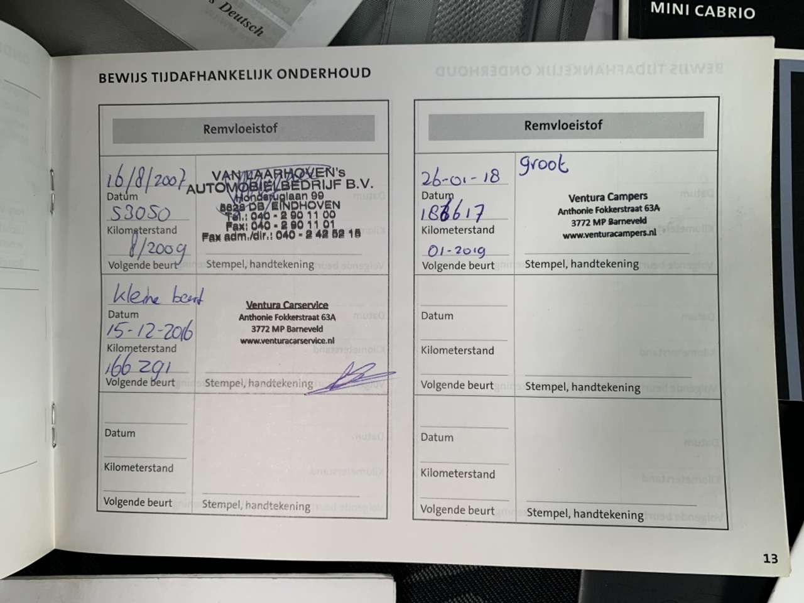
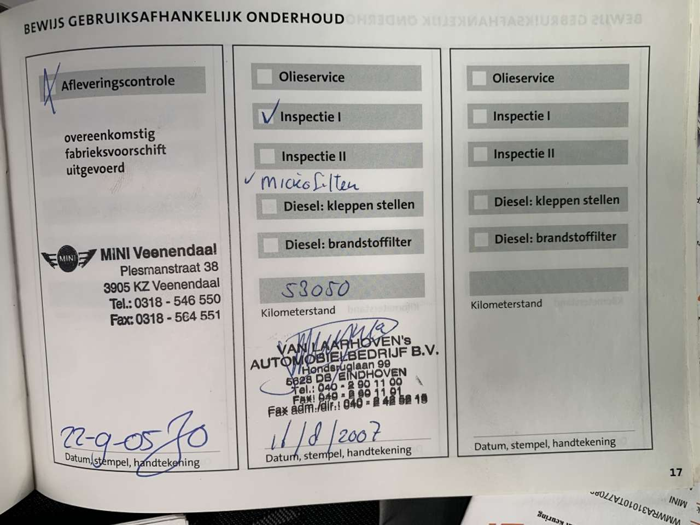
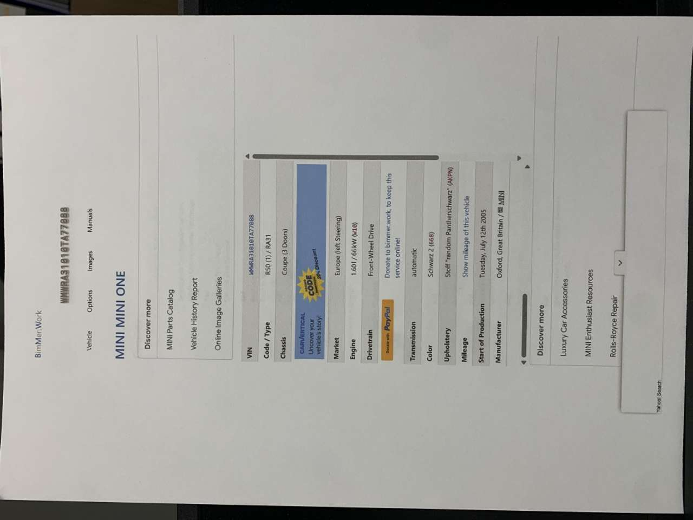
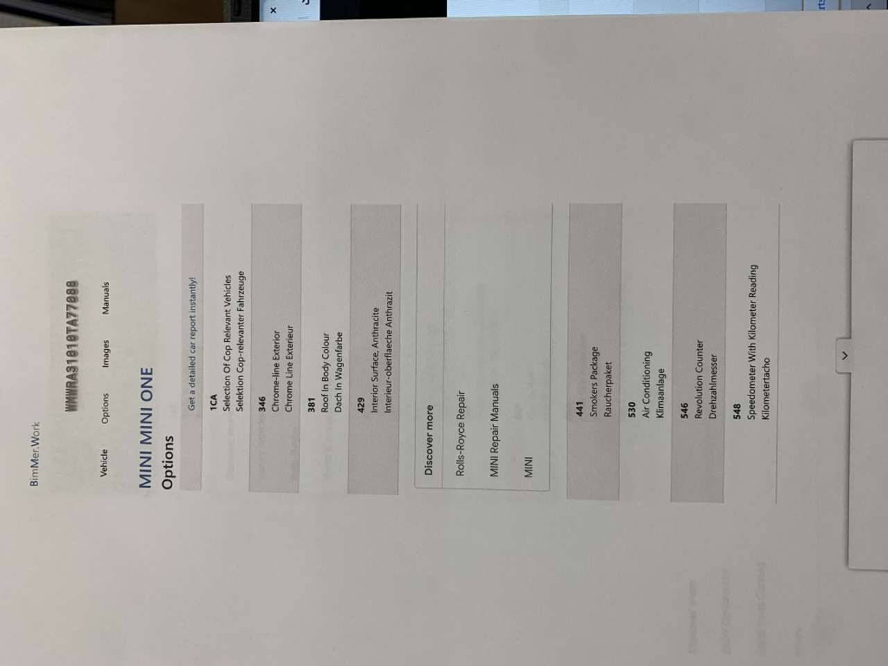
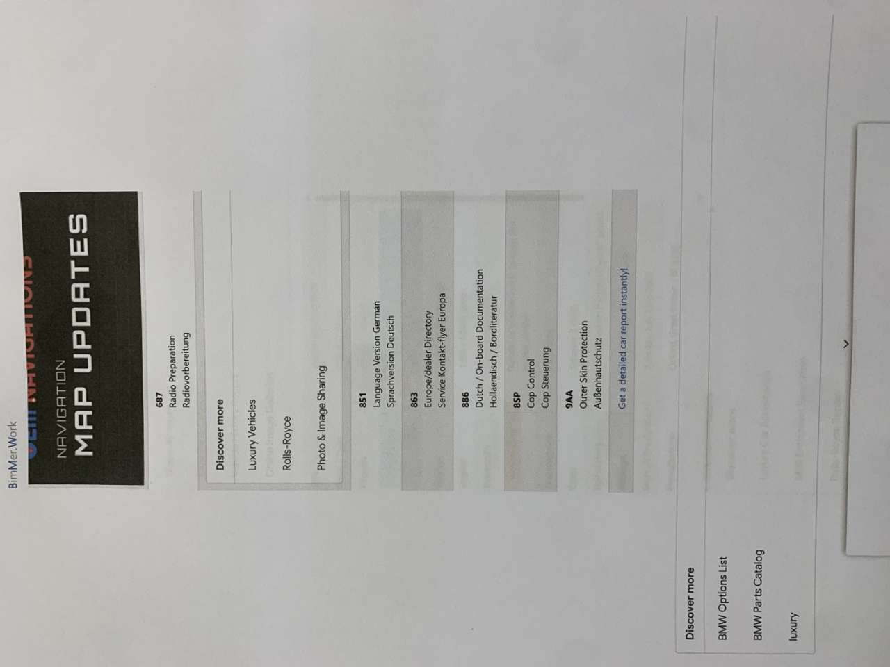

---

- **Referencia:** 20899321
- **Anuncio original:** https://www.autoscout24.es/anuncios/mini-one-gasolina-negro-cat_ma16338mo16602-fb034c95-e783-4892-8128-35c1d6e9515d?source=dealerpage_stock-list
